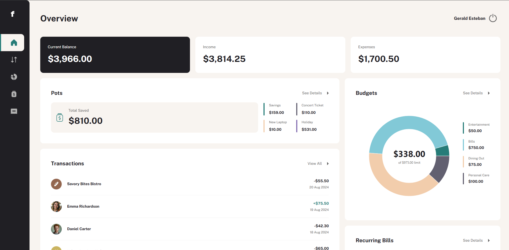

# React Personal Finance App

A Full Stack Personal Finance app, a challenge from Frontend Mentor at Guru difficulty.

# Highlights

- Built from scratch based on the design and requirements from a Frontend Mentor challenge, implementing a full stack personal finance app with overview, transactions, budgets, pots, and recurring bills.
- Added search, sort, filter, and pagination for transactions and bills.
- Implemented CRUD features, validation, and progress tracking for savings pots.
- Ensured responsive design, keyboard accessibility, and interactive UI states.
- Integrated database and user authentication for a full-stack setup.

# Technologies

- Vite
- JavaScript
- Tailwind
- React
- React Router
- React Query
- Node.js
- Supabase

# View Live Demo

- https://gce-react-personal-finance.vercel.app/
